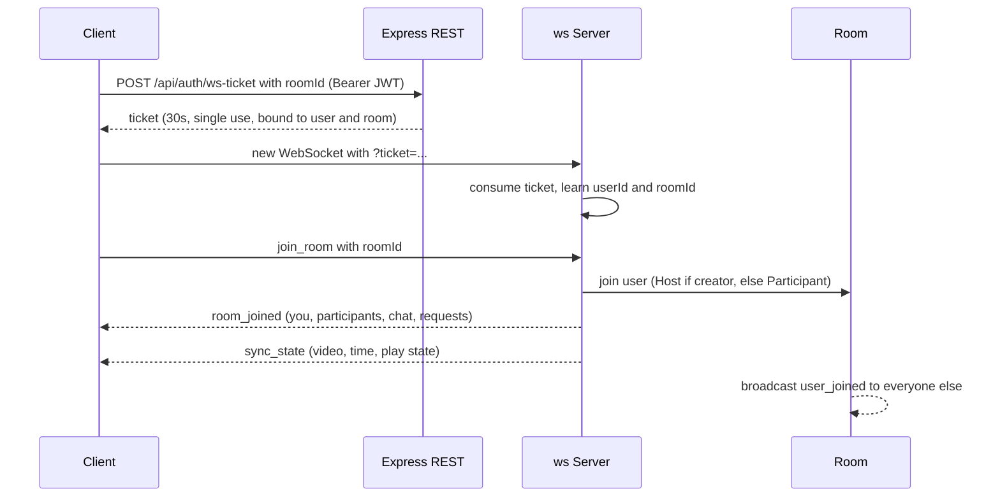
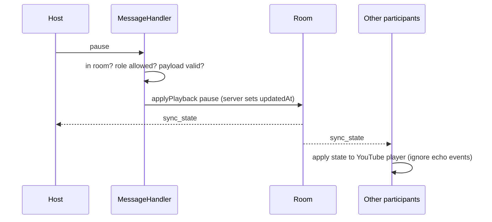
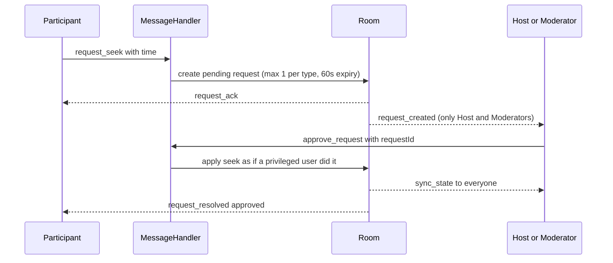

# 🎬 YouTube Watch Party

A full-stack, real-time web app where friends watch YouTube together in sync. Create a room, share the code, and everyone's player plays, pauses, seeks and switches video at the same moment. Roles decide who controls playback, and the **server** enforces them.


---

## 🌐 View Live URL's

|                             | Link                                                 |
| --------------------------- | ---------------------------------------------------- |
| 🎬 **Frontend (Vercel)**    | `https://youtube-watch-party-v2.vercel.app'          |
| 🖥️ **Backend API (Render)** | `https://youtube-watch-party-v2-server.onrender.com' |

## 🌐 View Live Button's

[](https://youtube-watch-party-v2.vercel.app/)

[](https://youtube-watch-party-v2-server.onrender.com/)

---

## 🌟 Features

- **Real-time video synchronization**: play, pause, seek and video changes reach everyone in the room instantly. The server keeps the one true playback state.
- **Rooms with unique codes**: create a room, get a 6-character code (like `ABC234`), and share the code or a direct `/watch/CODE` link.
- **Role-based access control (RBAC)**: **Host**, **Moderator** and **Participant**, checked on the server for every single event.
- **Host powers**: promote or demote Moderators, remove participants, transfer the Host role, and delete a room. If the Host leaves, the room picks a new Host automatically.
- **Participant control requests**: Participants can't control the video, but they can ask. Hosts and Moderators approve or reject in real time.
- **Late joiners and reconnects land in sync**: a new or returning user gets the current video, time and play state straight away.
- **Reconnection with a grace period**: refresh the page and you keep your seat and role (45 seconds).
- **Secure WebSocket auth**: short-lived, single-use tickets, so your login token never appears in a WebSocket URL.
- **Live participant list** with roles, **room chat**, connection status and toasts.
- **Native WebSockets**: browser `WebSocket` plus Node.js `ws`, no Socket.IO.
- **Event-loop prevention**: the player is only driven by server state, so remote changes never echo back as new events.
- **Persistent rooms**: rooms are saved in MongoDB and reload after a restart.

---

## 🛠️ Technology Stack

| Layer          | Technology                                                                                     |
| -------------- | ---------------------------------------------------------------------------------------------- |
| **Frontend**   | React 19, Vite 8, React Router 7, Axios, YouTube IFrame Player API, native browser `WebSocket` |
| **Backend**    | Node.js, Express 5, `ws`, JWT, bcryptjs, Helmet, CORS, express-rate-limit                      |
| **Database**   | MongoDB (Atlas in production) with Mongoose 9                                                  |
| **Testing**    | Vitest, Supertest, real `ws` clients                                                           |
| **Deployment** | Vercel (frontend), Render (backend), MongoDB Atlas (database)                                  |

---

## 🏗️ Architecture

### Big picture

```text
                         ┌──────────────────────────────┐
                         │      React + Vite (client)    │
                         │  Pages · Components · Hooks   │
                         │  YouTube IFrame Player        │
                         └───────┬───────────────┬───────┘
                      REST (HTTPS)│               │WebSocket (WSS)
                  accounts, rooms │               │ everything live
                                  ▼               ▼
                  ┌───────────────────────────────────────────┐
                  │          Node.js HTTP server (Render)      │
                  │  ┌──────────────┐    ┌──────────────────┐  │
                  │  │ Express (REST)│    │  ws WebSocketServer│ │
                  │  └──────┬───────┘    └────────┬─────────┘  │
                  │         │                     ▼            │
                  │         │            MessageHandler        │
                  │         │     parse · validate · authorize │
                  │         │                     ▼            │
                  │         │              RoomManager         │
                  │         │          active rooms in memory  │
                  │         │                     ▼            │
                  │         │                   Room           │
                  │         │  participants · playback · chat  │
                  │         │           · control requests     │
                  │         │                     ▼            │
                  │         │               Participant        │
                  └─────────┼─────────────────────────────────┘
                            ▼
                     MongoDB Atlas
                  (users, room records)
```

- **REST** handles things that happen once: register, log in, create or delete a room, look a room up, and get a WebSocket ticket.
- **WebSocket** handles everything live: join and leave, playback, roles, requests and chat. There is one socket per user per room.
- The `ws` server is attached to the **same HTTP server** as Express with no custom path, so the production WebSocket URL is just `wss://YOUR-SERVER.onrender.com`.
- Active rooms live in memory for speed. MongoDB stores users and room records, and is written to only when needed (never on every play, pause or seek).

### Connecting and joining a room



### Host controls playback



### Participant asks, Host approves



### Server building blocks

| Piece               | File                                     | Responsibility                                                        |
| ------------------- | ---------------------------------------- | --------------------------------------------------------------------- |
| **App**             | `server/src/app.js`                      | Express, Helmet, CORS, rate limit, routes                             |
| **Entry**           | `server/src/index.js`                    | Env check, MongoDB connect, HTTP + WebSocket start, graceful shutdown |
| **WebSocket setup** | `server/src/websocket/index.js`          | Authenticates the upgrade request with the ticket, heartbeat          |
| **MessageHandler**  | `server/src/websocket/MessageHandler.js` | Parse, validate, authorize, delegate                                  |
| **RoomManager**     | `server/src/websocket/RoomManager.js`    | Active rooms, load from and unload to MongoDB                         |
| **Room**            | `server/src/websocket/Room.js`           | Participants, roles, playback, requests, chat, broadcasting           |
| **Participant**     | `server/src/websocket/Participant.js`    | One user in one room: socket and rate limiters                        |
| **Permissions**     | `server/src/websocket/constants.js`      | The single role-to-action table                                       |
| **TicketService**   | `server/src/services/ticketService.js`   | Single-use, 30-second WebSocket tickets                               |

More detail: [docs/ARCHITECTURE.md](docs/ARCHITECTURE.md).

---

## 🔐 Roles and Permissions

| Action                                  | 👑 Host | 🛡️ Moderator |    👤 Participant    |
| --------------------------------------- | :-----: | :----------: | :------------------: |
| Play / pause / seek / change video      |   ✅    |      ✅      | ❌ (sends a request) |
| Approve or reject requests              |   ✅    |      ✅      |          ❌          |
| Assign roles (Moderator or Participant) |   ✅    |      ❌      |          ❌          |
| Remove participants                     |   ✅    |      ❌      |          ❌          |
| Transfer the Host role                  |   ✅    |      ❌      |          ❌          |
| Delete the room                         |   ✅    |      ❌      |          ❌          |
| Chat                                    |   ✅    |      ✅      |          ✅          |

**Rules**

- The room creator is the Host. Everyone who joins starts as a Participant.
- The Host cannot target themselves, and the `host` role only changes through a transfer or automatic succession.
- If the Host leaves, the longest-present Moderator (else the longest-present Participant) becomes Host.
- Removed users cannot rejoin that room.
- The UI hides what you can't do, but that is only for convenience. **The server rejects any unauthorized event** with a `FORBIDDEN` error, even if someone sends it by hand.

---

## 🔄 How Synchronization Works

The server stores `{ videoId, isPlaying, currentTime, updatedAt }` for every room. `updatedAt` is always set by the server and never trusted from a client. Everyone calculates where the video should be right now:

```text
expected = isPlaying ? currentTime + (now - updatedAt) / 1000 : currentTime
```

- **Late joiners** get a `sync_state` right after joining, so no constant "tick" messages are needed.
- **Drift correction**: every 5 seconds a client compares its player to the expected time and seeks only when more than 1.5 seconds off, so the video never stutters from constant seeking.
- **Clock offset**: each `sync_state` carries `serverTime`, which the client uses to estimate how far its clock is from the server's.
- **No event loops**: the YouTube player is only driven by server state. When the client applies a remote update it sets an `isRemoteActionRef` flag, so the resulting player events are ignored. Only the custom controls send events to the server, never the raw YouTube player callbacks.
- **No bypassing**: native YouTube controls are turned off (`controls: 0`, `disablekb: 1`) and a transparent shield sits over the video, so the custom controls are the only way to act.
- **Autoplay blocked?** If the browser blocks playback for a new joiner, a "Click to join the stream" button appears.
- Seeks are sent when you **release** the slider, not on every drag tick.

---

## 📁 Project Structure

```text
youtube-watch-party/
├── client/                          # React + Vite frontend
│   ├── src/
│   │   ├── components/              # PlayerPanel, ParticipantList, RequestsPanel, Chat,
│   │   │                            #   RoomTicket, RoleBadge, Toasts, ProtectedRoute
│   │   ├── context/                 # AuthContext
│   │   ├── hooks/                   # useRoomSocket, useYouTubePlayer, useToasts
│   │   ├── pages/                   # Login, Register, Dashboard, Watch (+ AuthForm)
│   │   ├── services/                # api.js (Axios), config.js (env URLs)
│   │   ├── utils/                   # format.js
│   │   ├── App.jsx · main.jsx · styles.css
│   ├── .env.example
│   ├── vercel.json                  # SPA rewrite so /watch/CODE links work
│   └── package.json
├── server/                          # Node.js + Express + ws backend
│   ├── src/
│   │   ├── config/                  # env.js, db.js
│   │   ├── controllers/             # authController, roomController
│   │   ├── middleware/              # auth, errorHandler
│   │   ├── models/                  # User, Room (Mongoose)
│   │   ├── routes/                  # authRoutes, roomRoutes
│   │   ├── services/                # ticketService, userService, roomService
│   │   ├── utils/                   # token, roomCode, youtube, rateLimiter, errors
│   │   ├── websocket/               # index, MessageHandler, RoomManager, Room,
│   │   │                            #   Participant, constants, protocol
│   │   ├── app.js
│   │   └── index.js
│   ├── tests/                       # unit, REST and real two-client WebSocket tests
│   ├── .env.example
│   └── package.json
├── docs/
│   ├── ARCHITECTURE.md
│   ├── WEBSOCKET_PROTOCOL.md
│   ├── TECHNICAL_INTERVIEW_GUIDE.md
│   ├── REQUIREMENTS_CHECKLIST.md
│   └── screenshots/
├── .gitignore
└── README.md
```

---

## 🚀 Quick Start (Run Locally)

### 1. Prerequisites

- **Node.js 18 or newer**
- **A MongoDB database**: a free [MongoDB Atlas](https://www.mongodb.com/atlas) cluster, or MongoDB installed locally

### 2. Environment variables

Copy the example files, then edit the server one.

```bash
cd server && cp .env.example .env
cd ../client && cp .env.example .env
```

**`server/.env`**

```env
PORT=5000
NODE_ENV=development
MONGODB_URI=mongodb+srv://<user>:<password>@<cluster>.mongodb.net/watch-party
JWT_SECRET=any-long-random-string
JWT_EXPIRE=7d
CLIENT_URL=http://localhost:5173
```

**`client/.env`**

```env
VITE_API_URL=http://localhost:5000/api
VITE_WS_URL=ws://localhost:5000
```

### 3. Install and run (two terminals)

**Terminal 1: backend**

```bash
cd server
npm install
npm run dev        # http://localhost:5000
```

You should see `MongoDB connected` and `Server listening on port 5000`.

**Terminal 2: frontend**

```bash
cd client
npm install
npm run dev        # http://localhost:5173
```

Open **http://localhost:5173**.

### 4. Try it with two users

1. Window 1: register, then click **Create room**. You are the Host.
2. Window 2 (a private/incognito window): register a second user and join with the 6-character code or the `/watch/CODE` link.
3. As Host, paste a YouTube link and press play. Both windows follow.
4. As the Participant, click **Request play**, then approve it as Host.
5. As Host, open **People** and try **Make moderator**, **Make host** and **Remove**.

### All commands

| Where     | Command           | What it does                            |
| --------- | ----------------- | --------------------------------------- |
| `server/` | `npm run dev`     | Start with auto-restart on file changes |
| `server/` | `npm start`       | Start for production                    |
| `server/` | `npm test`        | Run the 76 tests (no database needed)   |
| `client/` | `npm run dev`     | Start the dev server                    |
| `client/` | `npm run build`   | Production build into `client/dist`     |
| `client/` | `npm run preview` | Preview the production build            |

---

## ⚙️ Environment Variables

**Server (`server/.env`)**

| Variable      | Example                 | Notes                                                                                      |
| ------------- | ----------------------- | ------------------------------------------------------------------------------------------ |
| `PORT`        | `5000`                  | Render sets this automatically                                                             |
| `NODE_ENV`    | `development`           | Use `production` on Render                                                                 |
| `MONGODB_URI` | `mongodb+srv://...`     | **Required**                                                                               |
| `JWT_SECRET`  | long random string      | **Required**. Use a new one in production                                                  |
| `JWT_EXPIRE`  | `7d`                    | Login token lifetime                                                                       |
| `CLIENT_URL`  | `http://localhost:5173` | Exact frontend origin, **no trailing slash**. Used for CORS and the WebSocket origin check |

**Client (`client/.env`)**

| Variable       | Example                     | Notes                                          |
| -------------- | --------------------------- | ---------------------------------------------- |
| `VITE_API_URL` | `http://localhost:5000/api` | Ends in `/api`                                 |
| `VITE_WS_URL`  | `ws://localhost:5000`       | `wss://` in production. **No** `/api`, no path |

Never commit `.env` files. They are already in `.gitignore`.

---

## 📡 API Endpoints

| Method | Path                  | Auth                    | Purpose                                                               |
| ------ | --------------------- | ----------------------- | --------------------------------------------------------------------- |
| POST   | `/api/auth/register`  | none                    | Create an account, returns a JWT                                      |
| POST   | `/api/auth/login`     | none                    | Log in, returns a JWT                                                 |
| POST   | `/api/auth/logout`    | none                    | Stateless: the client drops its token                                 |
| POST   | `/api/auth/ws-ticket` | JWT                     | Body `{ roomId }`. Returns a 30-second single-use WebSocket ticket    |
| GET    | `/api/rooms`          | JWT                     | Rooms you host                                                        |
| POST   | `/api/rooms`          | JWT                     | Create a room                                                         |
| GET    | `/api/rooms/:roomId`  | JWT                     | Look up a room                                                        |
| DELETE | `/api/rooms/:roomId`  | JWT (current Host only) | Delete a room. Everyone inside gets `room_closed` and is disconnected |
| GET    | `/api/health`         | none                    | `{ "success": true, "message": "Server is running" }`                 |

Joining and leaving a room happens over the WebSocket, not REST.

---

## 🔌 WebSocket Protocol

Connect to `wss://YOUR-SERVER.onrender.com/?ticket=<ticket>`. Every message in both directions looks like:

```json
{ "type": "play", "payload": {} }
```

**Client to server**

| Event                                                                   | Who can send it |
| ----------------------------------------------------------------------- | --------------- |
| `join_room`, `leave_room`, `request_sync`                               | any member      |
| `play`, `pause`, `seek`, `change_video`                                 | Host, Moderator |
| `request_play`, `request_pause`, `request_seek`, `request_change_video` | Participant     |
| `approve_request`, `reject_request`                                     | Host, Moderator |
| `assign_role`, `remove_participant`, `transfer_host`                    | Host            |
| `chat_message`                                                          | any member      |

**Server to client**

`room_joined`, `sync_state`, `user_joined`, `user_left`, `role_assigned`, `participant_removed`, `removed_from_room`, `room_closed`, `host_transferred`, `request_ack`, `request_created`, `request_list`, `request_resolved`, `chat_message`, `error`

Every protected event is checked in this order: **authenticated, in a room, role allowed, payload valid, then change state and broadcast.** Failures send a structured error to the sender only:

```json
{
  "type": "error",
  "payload": {
    "code": "FORBIDDEN",
    "message": "Only the Host or a Moderator can control playback"
  }
}
```

Full payloads, error codes and close codes: [docs/WEBSOCKET_PROTOCOL.md](docs/WEBSOCKET_PROTOCOL.md).

---

## 🧪 Testing

```bash
cd server
npm test
```

**76 tests** cover:

- YouTube URL parsing (watch, youtu.be, embed, shorts)
- The permission matrix, playback math, host succession and the request lifecycle
- REST: register, login, invalid login, protected routes, create/look up/delete rooms, WebSocket tickets, health
- **Real two-client WebSocket flows**: play, pause, seek and change-video sync; Participant rejections; Moderator promotion; approvals and rejections; removal; host transfer; room deletion; reconnect with a fresh ticket; late joiners; chat isolation between rooms; room reload from the database

The tests use in-memory fakes for the two Mongoose models, so they run without a database. They do not exercise a real MongoDB or the YouTube player in a browser. After deploying, always check sync with two browser windows on the live URL.

---

## 🌐 Deployment

**Order matters: database, then backend, then frontend, then fix `CLIENT_URL`.**

### 1. MongoDB Atlas

Create a free cluster and a database user. Under **Network Access**, allow Render (`0.0.0.0/0` works). Copy the connection string, with your password URL-encoded if it has special characters.

### 2. Backend on Render

New **Web Service** from your GitHub repo.

| Setting           | Value         |
| ----------------- | ------------- |
| Root Directory    | `server`      |
| Build Command     | `npm install` |
| Start Command     | `npm start`   |
| Health Check Path | `/api/health` |

Environment variables: `NODE_ENV=production`, `MONGODB_URI`, `JWT_SECRET` (a **new** random value), `JWT_EXPIRE=7d`, `CLIENT_URL` (set after step 3).

Render supports WebSockets on the same port, so `wss://` works without extra setup. The server reads `process.env.PORT`, so don't hardcode a port.

### 3. Frontend on Vercel

Import the same repo.

| Setting          | Value           |
| ---------------- | --------------- |
| Root Directory   | `client`        |
| Build Command    | `npm run build` |
| Output Directory | `dist`          |

Environment variables:

```env
VITE_API_URL=https://youtube-watch-party-v2-server.onrender.com
VITE_WS_URL=wss://youtube-watch-party-v2-server.onrender.com
```

`client/vercel.json` rewrites every path to `index.html`, so links like `/watch/ABC234` don't 404.

### 4. Connect them

Go back to Render and set `CLIENT_URL` to your exact Vercel URL (no trailing slash), then redeploy the backend. A wrong `CLIENT_URL` shows up as CORS errors and a WebSocket that never connects.

### Final checks on the live URL

- [ ] Register, log in, create a room
- [ ] Join from a second window with the code
- [ ] Play, pause, seek and change video sync in both windows
- [ ] Promote a Participant to Moderator, then remove them
- [ ] A Participant's request gets approved by the Host

---

## 🩺 Troubleshooting

| Problem                                           | Likely cause and fix                                                                                         |
| ------------------------------------------------- | ------------------------------------------------------------------------------------------------------------ |
| Server stops with `Failed running 'src/index.js'` | Read the red error above it. It's usually one of the rows below                                              |
| `ECONNREFUSED 127.0.0.1:27017`                    | MongoDB isn't running locally. Start it, or use an Atlas URI in `MONGODB_URI`                                |
| `Could not connect... IP that isn't whitelisted`  | Add your IP (or `0.0.0.0/0`) under Atlas **Network Access**                                                  |
| `bad auth : Authentication failed`                | Wrong Atlas username or password. URL-encode special characters                                              |
| `EADDRINUSE :::5000`                              | Another server is already on port 5000. Close it or change `PORT`                                            |
| `Missing required environment variables`          | `server/.env` is missing or you're not running from the `server` folder                                      |
| Login fails with a network error                  | Server isn't running, or `VITE_API_URL` points to the wrong place                                            |
| CORS error in the browser console                 | `CLIENT_URL` doesn't match the frontend origin exactly                                                       |
| Room stays on "Connecting" or "Reconnecting"      | Wrong `VITE_WS_URL` (needs `wss://` in production, no `/api`), or the server is asleep on Render's free tier |
| `/watch/CODE` shows a 404 on Vercel               | Make sure `client/vercel.json` is deployed                                                                   |

---

## 🛡️ Security

- Passwords are hashed with bcrypt and never stored or returned in plain text
- JWT authentication on all protected REST routes
- **WebSocket tickets**: 30-second TTL, single use, bound to one user and one room, kept in server memory
- **Server-side RBAC** on every WebSocket event. Identity and role come from the server, never from the client's message
- Helmet, an origin allow-list for CORS and for the WebSocket upgrade, and rate limiting on the auth routes
- Per-user limits: chat 5 messages per 5 seconds, requests 1 per 2 seconds. Messages are capped at 16 KB
- Malformed JSON, wrong shapes and unknown events return a structured error and never crash the server
- Chat is rendered as plain text, so messages can't inject HTML

---

## 🧠 Design Decisions and Trade-offs

- **Server-authoritative state**: clients never decide playback. This makes late joiners and role enforcement simple.
- **Native `ws` instead of Socket.IO**: lighter, and matches the assignment. The cost is writing heartbeat, reconnect and room logic ourselves.
- **WebSocket tickets**: browsers can't set headers on `new WebSocket()`, and putting a long-lived JWT in a URL leaks it into logs.
- **In-memory active rooms, MongoDB for durable data**: a fast real-time path, with rooms that survive restarts. Saved on create, video change, host change and unload, never on play, pause or seek.
- **Empty rooms are unloaded after 60 seconds but kept in MongoDB**, and deleted automatically after 7 days idle. Joining a saved room reloads it paused at the last saved video and time, and the creator regains Host.
- **45-second disconnect grace period**: a refresh doesn't cost you your role.

---

## 📈 Scaling Notes

This is a **single-instance design**: active rooms and tickets live in one Node process. To scale out:

```text
            Load Balancer
                  |
      ------------------------
      |           |          |
    WS #1       WS #2      WS #3
      |           |          |
      ------- Redis Pub/Sub --------
                  |
               MongoDB
```

Redis Pub/Sub would carry room events between instances so a broadcast on one server reaches users on the others. Tickets and room membership would move to Redis too. Socket.IO's Redis adapter doesn't apply here, so with `ws` you publish room events to a Redis channel yourself. All broadcasts already go through `Room.broadcast()`, `broadcastExcept()` and `broadcastToPrivileged()`, so that layer would be added in one place. Mongoose's default connection pool handles database connections.

The current version does not claim to support 1,000+ users.

---

## ⚠️ Known Limitations

- Single server instance. Rooms and tickets in memory are lost if the process restarts. Rooms reload from MongoDB, and tickets are simply requested again.
- After a restart, a room has no Host until its creator rejoins.
- The removed-users list is in memory, so it resets when a room is unloaded.
- The JWT is stored in `localStorage`, which is simple but exposed to XSS. httpOnly cookies would be safer.
- The clock offset ignores network latency, so sync is accurate to about one network round trip.
- Chat keeps only the last 50 messages, in memory.

---

## 🔮 Future Improvements

Redis Pub/Sub with multiple instances, httpOnly cookie sessions, persisted chat and message deletion, host-configurable Moderator permissions, and a demo video.

---

## 📚 Documentation

- 📖 [Architecture](docs/ARCHITECTURE.md)
- 🔌 [WebSocket Protocol](docs/WEBSOCKET_PROTOCOL.md)
- 🎤 [Technical Interview Guide](docs/TECHNICAL_INTERVIEW_GUIDE.md)
- ✅ [Requirements Checklist](docs/REQUIREMENTS_CHECKLIST.md)

---

## 👨‍💻 Author

**Karan Maurya**

- GitHub: [@karanaurya-git](https://github.com/karanaurya-git)
- LinkedIn: [karan-maurya-4260b6293](https://linkedin.com/in/karan-maurya-4260b6293/)

## 📄 License

MIT License.
